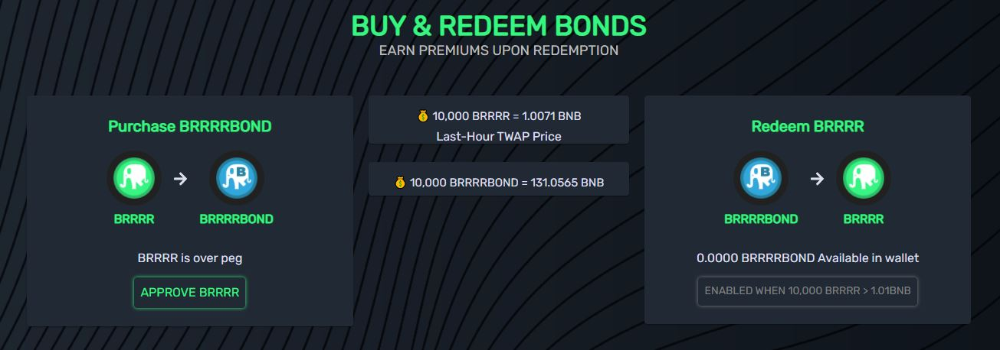

# Bonds (BRRRRBOND)

### What are BRRRRBOND (Bonds)?

Bonds are unique tokens that can be utilized to help stabilize BRRRR price around peg (10,000 BRRRR = 1 BNB) by reducing the circulating supply of BRRRR if the TWAP (time-weighted average price) goes below peg

### When can I buy BRRRRBOND (Bonds)?

BRRRRBOND can be purchased only during periods of supply contraction and when the TWAP of BRRRR is below 1. At the beginning of every new epoch during contraction periods, BRRRRBONDs are issued in the amount of 3% of BRRRR's circulating supply, with a max debt amount of 35%. This means that if bonds reach 35% of the circulating supply of BRRRR, no more bonds will be issued.&#x20;


Note that during a zen epoch (when an epoch ends with a TWAP between 1.0 - 1.01), **no BRRRRBOND will be issued**, even though the **** Boardroom does not print**.**&#x20;



**BRRRRBOND TWAP (time-weighted average price) is based on the BRRRR TWAP from the previous epoch as it ends. In other words, the BRRRR TWAP is real-time but the BRRRRBOND TWAP is not.**


### Where can I buy BRRRRBOND (Bonds)?

YYou can buy BRRRRBONDs if any are available through (equilibrrrrium.money) in the Pit. Anyone can buy as many BRRRRBONDs as they want as long as they have enough BRRRR to pay for them. There is a limit of available BRRRRBONDs per epoch during contraction periods (3% of BRRRR's current circulating supply), and are sold first-come-first-serve.

### Why should I buy BRRRRBOND (Bonds)?

The first and most important reason to buy BRRRRBOND is that they help to maintain the peg, but they are not the only measure in place to keep the protocol on track.

&#x20;BRRRRBONDs don't have an expiration date, so you can view them as an investment in the long-term health of the protocol to be redeemed for a premium at a later date.&#x20;

**Incentives for Holding BRRRRBOND**&#x20;

The idea is to reward BRRRRBOND buyers for helping the protocol, while also protecting the protocol from being manipulated by big players.&#x20;

So after you buy BRRRRBOND using BRRRR, you have two possible ways to get your BRRRR back:

1. Sell back your BRRRRBOND for BRRRR while the peg is between 1 - 1.1 (10,000 BRRR = 1 BNB) with no redemption bonus. This is in place to prevent an instant dump as soon as peg is recovered.
2. Sell back your BRRRRBOND for BRRRR while the peg is above 1.1 (10,000 BRRRR = 1 BNB) with a bonus redemption rate. The longer you hold, the more both the protocol and you benefit from BRRRRBOND.


Example:

1. **When BRRRR = 0.8, burn 1 BRRRR to get 1 BRRRRBOND (BRRRRBOND price = 0.8)**
2. **When BRRRR = 1.15, redeem 1 BRRRRBOND to get 1.105 BRRRR (BRRRRBOND price = 1.27)**


So, which one is better?

IIf I buy BRRRR at 0.8, and hold it until 1.15 and then sell, I'm getting +$0.35 per BRRRR.

&#x20;But, if I buy BRRRR at 0.8, burn it for BRRRRBOND, and redeem it at 1.15, I'm getting 1.105 BRRRR \* 1.15 (BRRRR current price) = 1,271 (+$0.47) per BRRRRBOND redeemed.

&#x20;But, what if getting back to peg is taking too long?&#x20;

We will adjust our use cases to have different behaviors on contraction and expansion periods to benefit both BRRRR and BRRRRBOND holders when needed.

### What is the formula to calculate the redemption bonus for BRRRRBOND?

To encourage the redemption of BRRRRBOND for BRRRR when BRRRR's TWAP > 1.1 and in order to incentivize users to redeem bonds at a higher price, BRRRRBOND redemption is designed to be more profitable with a higher BRRRR TWAP value.&#x20;

The BRRRRBOND to BRRRR ratio is 1:R, where R can be calculated using the formula as shown below:

$$
R=1+[(BRRRRtwapprice)-1)*coeff)]
$$

$$
coeff = 0.7
$$

### When can I swap BRRRRBOND for a premium?

You can only redeem BRRRRBONDs for a premium when the previous epoch's TWAP is greater than 1.1.
