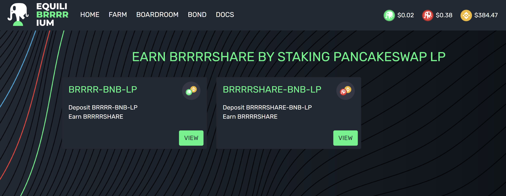

# Farms

To incentivize healthy liquidity pools for the EquiliBRRRRium protocol tokens, our LP farms have been seeded with BRRRRSHARE to be distributed as rewards to LP stakers across a time period of 12 months. The total BRRRRSHARE rewards are distributed from each farm as follows:

* **BRRRR-BNB LP: 65% of BRRRRSHARE rewards**
* **BRRRRSHARE-BNB LP: 35% of BRRRRSHARE rewards**

### **1. What will happen when the circulating supply equals the total supply? Will reward emissions stop?**

Yes. Once the max supply of BRRRRSHARE (70k) is reached, reward emissions end. This will happen in exactly one year from when the BRRRRSHARE farms started on November 25th, 2021. BRRRRSHARE will always continue to print BRRRR in the Boardroom, though, as long as BRRRR remains above peg.


BRRRRSHARE reward emissions for the current LP farms are scheduled to end on- insert ending date here- once the total BRRRRSHARE supply has been distributed.


### 2. Why is "at-peg" (TWAP between 1.00 and 1.01) the best time to provide liquidity?

When BRRRR is pegged or close to being pegged at 10,000 BRRRR to 1 BNB, it is more akin to having exposure to a single asset (single staking) than to your traditional LP'ing experience, where you would run the risk of impermanent loss if one of the tokens went up in value and the other did not.

### 3. Wait, you mean that if BTC pumps, BRRRR pumps with it?

**Yes!**\
\
Let's look at an example:

If BNB pumps in price, it won't "outrun" BRRRR, even if nobody is buying BRRRR at that time.\
\
The farm APRs will vary in terms of USD value, but the emissions won’t. This is something that wouldn't be possible with another 1:1 pegged asset like a stablecoin LP position, where the USD value is directly tied to the emissions. If BNB rises in USD value, BRRRR goes with it. Similarly, if BNB falls in USD value, BRRRR will be worth less in USD, **but it won’t affect the peg.**


The only thing that can change the price of BRRRR in terms of its BNB value (and as such, the peg) is buying and selling it.

